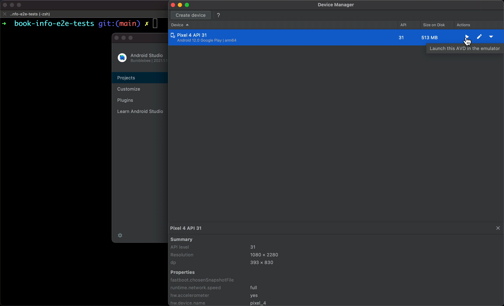

# Worqference 2023 - Bootstrap Project

This is a bootstrap project for the workshop "Designing a common Test Automation Framework for Web & Mobile Apps with WebdriverIO".

This readme has details about setup required and commands to run the Web and Android tests.

## Pre-requisites

### Install the following:

- [Git](https://git-scm.com/downloads). If you are using a windows machine, please install [Git for Windows](https://gitforwindows.org/).
- [Node and NPM](https://nodejs.org/en/). Please use the current version v19.6.0.
- [Visual Studio Code](https://code.visualstudio.com/download) or any other IDE of your choice.

### Get the bootstrap project:

- Clone the repository. On your terminal (or Git BASH), run the command to clone the repository:
  ```block
  git clone https://github.com/bitweft/book-info-e2e-tests.git
  ```
- Now, go into the project directory by running the command:
  ```block
  cd book-info-e2e-tests
  ```
- Install the project dependencies by running the following command from the project directory:
  ```block
  npm install
  ```

### Running Web Tests:

- Please ensure [Chrome browser](https://www.google.com/intl/en_ca/chrome/) is installed.
- To run the web tests, from the project directory (book-info-e2e-tests), run the following command:
  ```block
  npm run test:web:chrome
  ```
- The browser will launch and you will see the test results on the terminal.
  

### Emulator Setup for Android tests:

- Java. It could be either [open JDK](https://openjdk.org/projects/jdk/) or Oracle JDK. Ensure that JAVA_HOME environment variable is set.
- Install [Android Studio](https://developer.android.com/studio) and open it.
- Select `More Actions` and choose `Virtual Device Manager`. Then select `Create Device`.
  
- Choose a device, select any system image (download one if required), and then `Finish` creating the emulator.
  
- Launch the emulator by clicking the play icon.
  

### Path and environment variables setup:

- First, let's find the path to Android SDK.

  - On Mac devices, the path is typically `/Users/<username>/Library/Android/sdk`. We can check this by running the `ls` command:

    ```block
    ls /Users/<username>/Library/Android/sdk
    ```

    

  - On Windows, the path is typically `C:\Users\<username>\AppData\Local\Android\sdk`. We can check this by running the `ls` command from Git BASH. Do note: Use forward slashes in Git Bash.
    ```block
    ls /c/Users/<username>/AppData/Local/Android/Sdk
    ```

- Prepare the commands to set ANDROID_HOME and tools to path.
  - If the Android sdk path is `/Users/<username>/Library/Android/sdk`, then we need to add the following to the bashrc file:
    ```block
    export ANDROID_HOME="$HOME/Library/Android/sdk"
    export PATH="$PATH:$ANDROID_HOME:$ANDROID_HOME/platform-tools/:$ANDROID_HOME/tools/:$ANDROID_HOME/build-tools/"
    ```
  - If the Android sdk path (typical on a Windows machine) is `C:\Users\<username>\AppData\Local\Android\sdk`, then we need to add the following to the bashrc file:
    ```block
    export ANDROID_HOME="/c/Users/<username>/AppData/Local/Android/Sdk"
    export PATH="$PATH:$ANDROID_HOME:$ANDROID_HOME/platform-tools/:$ANDROID_HOME/tools/:$ANDROID_HOME/build-tools/"
    ```
    Do replace `<username>` with the username on your machine.
- To add the above to the `~/.bashrc`:

  - Use `vim ~/.bashrc` command to open the file.
  - Press `i` to go into insert mode.
  - On a new line at the end of the file, paste the export commands from above.
  - Add a new line to the end of the file.
  - Save and close the file by pressing `Esc` `:wq` followed by `Enter`.
  - source the bashrc file by running: `source ~/.bashrc`
  - You can confirm if it was set correctly by running the `echo $ANDROID_HOME` command.
    

- Add JAVA_HOME to bashrc:
  - Similar to the above, find path to Java JDK and set that in `JAVA_HOME` environment variable.
  - Typically on Mac, you will need to add the following to your `~/.bashrc` (Do update the `<jdk-version>`):
    ```block
    export JAVA_HOME="/Library/Java/JavaVirtualMachines/<jdk-version>/Contents/Home/"
    ```
  - Typically on a Windows machine, you will need to add the following to your `~/.bashrc` file via Git Bash (Do update the `<jdk-version>`):
    ```block
    export JAVA_HOME="/c/Program Files/Java/<jdk-version>"
    ```
  - Run `source ~/.bashrc` after updating the file.

### Running Android Tests:

- The path of the demo app file is: `/<absolute-path-to-project-directory>/book-info-e2e-tests/resources/book-info.apk`. Keep a note of the absolute path to the apk file.
- Test run command:
  ```block
  npm run test:app:android -- --app_path=/<absolute-path-to-project-directory>/book-info-e2e-tests/resources/book-info.apk --devices='emulator-5554'
  ```
  

### To inspect elements on apps:

- Install Appium globally using the command:

  ```block
    npm install -g appium
  ```

- Download and install [Appium Inspector](https://github.com/appium/appium-inspector/releases/tag/v2022.11.1)
- Start Appium server from the terminal by running the command `appium`. Appium will start on the default port `4723`:
  
- Launch Appium inspector and set the remote path to `/wd/hub`
- Add the following capabilities after replacing the `<absolute-path-to-project>` with your path:
  ```block
  {
    "platformName": "Android",
    "appium:deviceName": "Pixel 4",
    "appium:automationName": "UiAutomator2",
    "appium:app": "/<absolute-path-to-project>/book-info-e2e-tests/resources/book-info.apk"
  }
  ```
  
- You will be able to inspect the elements
  
- To stop Appium server, press `ctrl + c` on the terminal where you started it
  

### Cucumber Plugin for VSCode

You can use some plugins on VsCode to be able to easily navigate between feature files and steps.

- Select `Extensions` from the panel and search for `cucumber`
  
- I've used the Cucumber (Gherkin) Full Support plugin. You can select and `Install` it.
  
- Now, open `Command Palette` by pressing `ctrl + shift + P` / `cmd + shift + P` (on mac)
- Search for `>Preferences: Open User Settings (JSON)` and open the `settings.json` file
- Add the path to the step definitions inside the json object:
  ```block
    "cucumberautocomplete.steps": [
      "tests/step-definitions/**/*.ts"
    ],
    "cucumberautocomplete.strictGherkinCompletion": true
  ```
  Update the `tests/ste-definitions/**/*.ts` path based on your OS
- Sometimes, there may be a need to reopen VSCode for the setting to take effect

## Common Issues and Resolutions

### Version support issues

- While running web tests on Chrome, you might have an issue `This version of ChromeDriver only supports Chrome version X. Current browser version is Y`
  
- This happens because the chromedriver version mentioned in package.json of this repository does not support the Chrome browser version installed on your machine
- To fix this, you can uninstall chromdriver and reinstall the one that supports your version of Chrome Browser. Your current Chrome Browser version will be displayed in the location of green box in the above screenshot:
  ```block
  npm uninstall chromedriver
  npm install chromedriver@109 --save-dev
  ```
  Replace `@109` with the correct `@<version-number` or `@latest` if you have the latest version of Chrome browser.

### Requested port may already be in use

- While running Android tests, you may see an error that says `The requested port may already be in use`
  
- This happens because we are unable to start Appium server on the default port 4723 since something else is running on that port
- You can kill the service running on that port and re-run the tests

### The application at '...book-info.apk' does not exist or is not accessible

- While running Android tests, you may see that the error says `The application at '...book-info.apk' does not exist or is not accessible`
  
- This happens when the `--app_path` provided is incorrect or the app does not have correct permissions
- Ensure that you are using the absolute path to the apk
